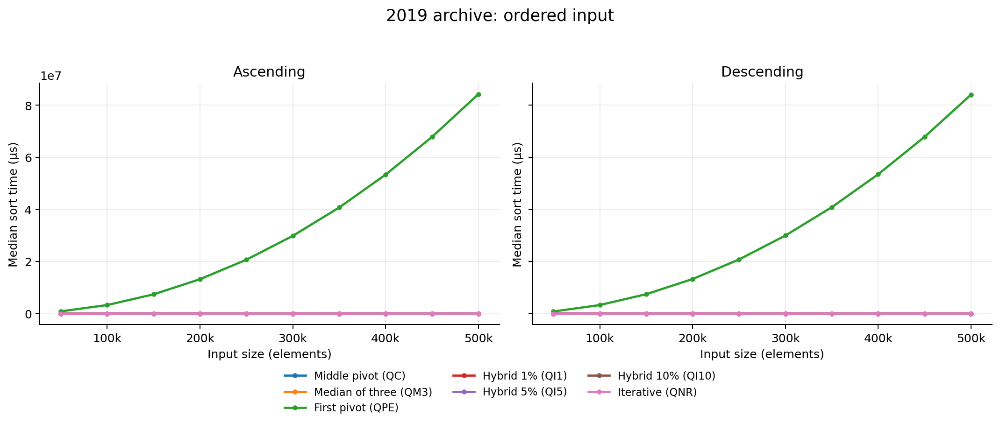
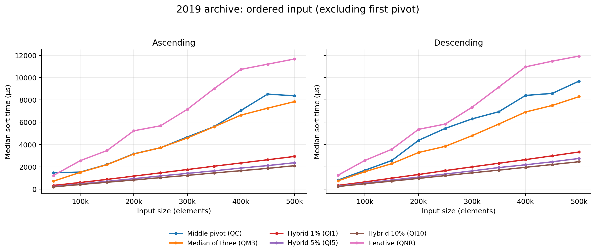
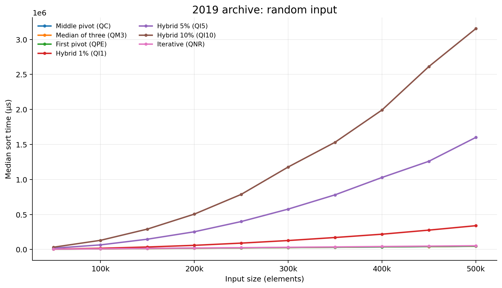
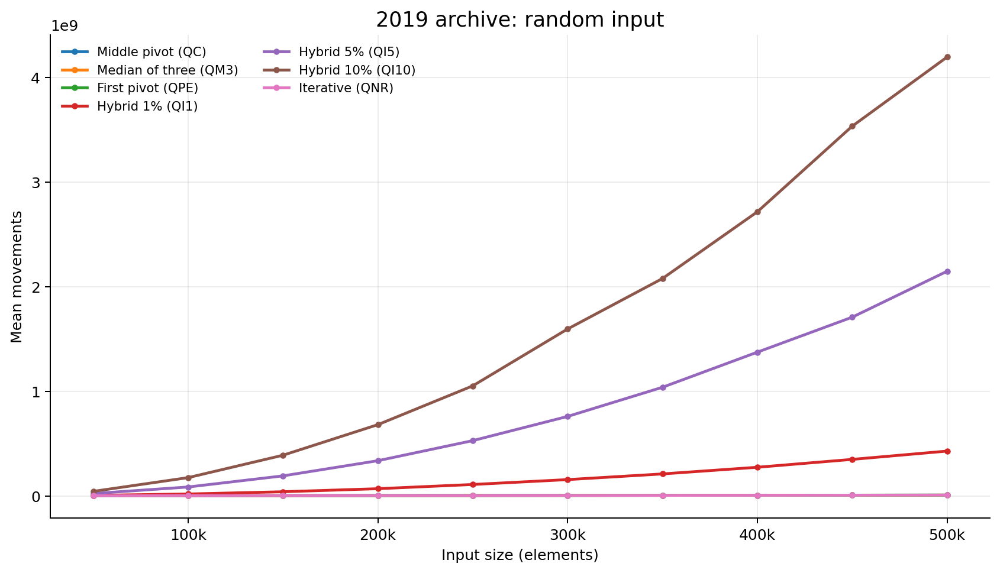
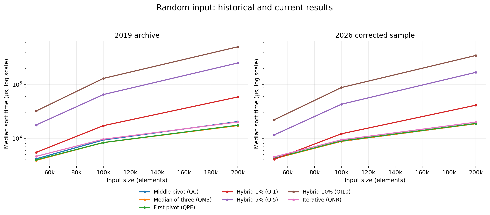

# Quicksort Variants Benchmark

A C17 study of seven quicksort variants on ascending, descending, and generated random
integer arrays. This project modernizes a 2019 data structures assignment by preserving its
algorithms and archived evidence, correcting known implementation defects, and making its
measurements and tests reproducible. The author is Lucas Paulo Martins Mariz.

## Build and run

Use a POSIX system with `make` and GCC or Clang. The benchmark uses `clock_gettime` with
`CLOCK_MONOTONIC`.

```sh
make
./sort median-of-three random 50000 --seed 42
./sort first-pivot descending 1000
./sort iterative ascending 10 --print
./sort --help
```

The command is `./sort <variant> <input_order> <size> [-p|--print] [--seed N]`. Sizes from
1 to 500,000 are accepted. The historical study used 50,000 to 500,000 in steps of 50,000.
`--seed` accepts an unsigned decimal integer; the default seed comes from the current time.
The legacy variant codes and `OrdC`/`OrdD`/`Ale` input codes remain accepted. The first two
output fields repeat the names supplied to the command, so older scripts can still use the
original codes.

| Variant | Legacy code | Pivot and stopping rule |
| --- | --- | --- |
| `middle-pivot` | `QC` | Middle element value; recursive quicksort. |
| `median-of-three` | `QM3` | Median of the first, middle, and last values. |
| `first-pivot` | `QPE` | First element value; quadratic behavior on ordered input. |
| `hybrid-1` | `QI1` | Median of three, then insertion sort at a 1% partition cutoff. |
| `hybrid-5` | `QI5` | The same hybrid with a 5% cutoff. |
| `hybrid-10` | `QI10` | The same hybrid with a 10% cutoff. |
| `iterative` | `QNR` | Middle element value and an explicit range stack. |

The result is one space-separated line:

```text
<variant> <input_order> <size> <mean_comparisons> <mean_movements> <median_time_us>
```

Each run sorts 20 arrays. It reports the mean comparison count rounded to a whole number,
the mean movement count truncated to a whole number, and the median sort time in
**microseconds (`µs`)**. Only the sort is timed. The 20 durations are sorted, and the two
middle values are averaged with integer arithmetic. A very small sort can register zero
microseconds. `--print` adds the 20 original arrays after the result line.

A partition counts successful scan comparisons and the two terminating checks per scan
iteration. A swap counts three movements, including a self-swap; insertion sort counts
shifted assignments and placement of the key. Ascending input contains `1..n`, descending
input contains `n..1`, and random input retains the original generator
`(rand() % n) * 10 + 1`. Random values can repeat. A seed reproduces a run on the same C
library, but `rand()` sequences can differ between C libraries.

## Historical results (2019)

The [original report](historical-results/original-report-2019.pdf) describes a 20-trial
experiment on an Intel Core i5-7200U with 8 GB of RAM, Ubuntu 18.04.2, and GCC 7.4.0.
The archived [three-movements-per-swap CSV](historical-results/three-movements-per-swap.csv)
contains every combination of 7 variants, 3 input orders, and 10 input sizes. The
[one-movement-per-swap CSV](historical-results/one-movement-per-swap.csv) records an
alternative movement convention. The report uses the three-movement convention for its
main analysis.

The original CSV time header said milliseconds, while the report and C calculation specify
microseconds. The CSV headers now use `median_time_us`; their data rows were not changed.
All figures below read the archived numbers directly and label time in `µs`. The
[original PNG plots](historical-results/plots/three-movements-per-swap/) remain available
for visual comparison. The new renderings preserve their curve shapes and numerical points;
the titles, legends, and axis units are now in English.

| 500,000 elements | Ascending time (µs) | Descending time (µs) | Random time (µs) |
| --- | ---: | ---: | ---: |
| Middle pivot (`QC`) | 8,365 | 9,682 | 46,114 |
| Median of three (`QM3`) | 7,841 | 8,288 | 46,710 |
| First pivot (`QPE`) | 84,256,470 | 84,048,960 | 46,837 |
| Hybrid 10% (`QI10`) | 2,096 | 2,453 | 3,152,874 |

The ordered-input plot needs a companion zoom: the first-pivot series reaches roughly
84 million `µs` at 500,000 elements and compresses the other six series on a shared linear
axis. Its growth is consistent with quicksort's quadratic worst case, not exponential
growth.



*Archived median time, ascending and descending input, all variants. Source: the 2019
three-movement CSV. Both panels label time in microseconds.*



*The same archived CSV and time unit, excluding `QPE` only to make the other curves legible.*



*On the archived random inputs, the insertion hybrids grow markedly more expensive as
their cutoff increases.*



*Mean movements for the report's three-movements-per-swap convention. Do not combine this
series with the alternative one-movement CSV.*

The original ascending-time PNG and the new ordered-input figure both rise to the archived
`QPE` value of 84,256,470 `µs` at 500,000 elements. The original random-time PNG and the
new random-input figure both end at 3,152,874 `µs` for `QI10`. The plotting tests compare
all 210 time points, for each input order, directly with the CSV; the visible differences
are English labels, explicit units, a two-panel layout, and the companion zoom. This
re-rendering does not depend on current hardware.

These are **archived measurements of the old implementation**. Its recursive
median-of-three path often chose the middle pivot instead; the iterative path omitted the
last element; the hybrid insertion loop could cross a partition boundary; and the old
timing-median code accessed an element beyond its array. The stored results show what the
2019 run recorded, not validated performance of the corrected variants. The report also
claims identical movements for `QC`, `QM3`, and `QNR` in all cases, but their random-input
CSV rows differ.

## Corrected sample (2026)

The corrected implementation was sampled on 13 September 2026 using an AMD Ryzen 5 3600,
Ubuntu Linux, GCC 13.3.0 with `-O3`, seed `42`, and 20 trials per case. The
[59-row sample CSV](docs/results/corrected-sample-2026-09-13.csv) and its
[environment metadata](docs/results/corrected-sample-2026-09-13.metadata.json) are stored
separately from the archive. It covers 50,000, 100,000, and 200,000 elements for each
variant/input combination, except ordered first-pivot cases above 50,000 because of their
quadratic cost.

| Random input, 200,000 elements | 2019 archive (µs) | 2026 corrected sample (µs) |
| --- | ---: | ---: |
| Middle pivot (`QC`) | 20,545 | 18,793 |
| Median of three (`QM3`) | 17,313 | 18,769 |
| First pivot (`QPE`) | 17,586 | 18,954 |
| Hybrid 1% (`QI1`) | 58,900 | 41,438 |
| Hybrid 5% (`QI5`) | 252,522 | 169,073 |
| Hybrid 10% (`QI10`) | 504,471 | 348,415 |
| Iterative (`QNR`) | 20,176 | 20,033 |



*The panels use the same logarithmic microsecond scale and the same input sizes. The old
seed is unknown. Hardware, compiler, clock, and corrected algorithms differ, so the values
must not be interpreted as controlled speedup factors.*

The unsafe 2019 executable was not rerun as a benchmark on the current machine. Its
out-of-bounds timing path and unknown random seed would make a direct same-hardware speedup
claim unreliable. The archival CSV was re-rendered unchanged, and the corrected code was
measured separately with recorded conditions.

Both datasets show the first-pivot degeneration on ordered input and increasing random-input
cost for larger insertion cutoffs. Individual rankings and timings can change. In the new
sample, the 10% hybrid is the fastest on ordered arrays at all sampled sizes and the slowest
on random arrays. The repaired median-of-three and iterative implementations can also
change comparison and movement counts; those differences cannot be assigned solely to a
single fix because the old random seed was not recorded.

## Reproduce the checks and figures

```sh
make test               # C unit tests, CLI tests, data checks, fault injection
make sanitize           # AddressSanitizer and UndefinedBehaviorSanitizer
make analyze            # GCC static analyzer
make coverage           # report in build/coverage/summary.txt
make check-format       # requires clang-format-18
```

The [CI workflow](.github/workflows/ci.yml) runs GCC and Clang tests with job and step
timeouts. It also checks formatting, static analysis, coverage, archived data, and chart
generation. Leak detection is enabled in CI; the local default disables it where
LeakSanitizer is incompatible with the execution environment.

Chart regeneration requires Python 3 and Matplotlib (for example, the
`python3-matplotlib` package on Ubuntu):

```sh
make figures
python3 tests/test_plot_results.py
```

The plotting script rejects incomplete or duplicate source rows, and the figure test checks
that every plotted point equals its CSV value. To collect the same bounded sample on another
machine:

```sh
make clean && make CC=gcc CFLAGS=-O3
python3 scripts/run_current_sample.py --binary ./sort \
  --output docs/results/corrected-sample-2026-09-13.csv \
  --seed 42 --compiler gcc --cflags=-O3
make figures
```

Choose a different output filename if keeping the checked-in 2026 evidence. For the full
historical 7 × 3 × 10 grid, `make benchmark-matrix BENCHMARK_SEED=42` writes a validated
CSV under `build/`; this is an explicit, potentially long-running command because ordered
first-pivot sorting is quadratic. It is intentionally excluded from routine CI.

The layout is `src/` for implementations, `include/` for interfaces, `tests/` for automated
checks, `scripts/` for collection and plotting, `historical-results/` for the original
PDF and PNGs plus CSVs with normalized headers, and `docs/results/` plus `docs/figures/` for the
corrected sample and English-labeled plots.
